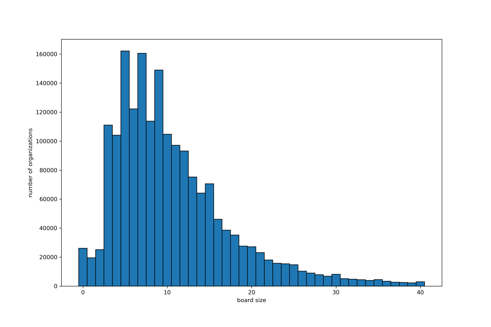

# nine-ninety

> Predict with nonprofit tax returns.

- [Install](#install)
- [Basic Usage](#basic-usage)
- [Background](#background)
- [Models](#models)
- [License](#license)

## Install

This package requires Python 3.8. If using conda, you can create a new environment to install the correct Python version.

```sh
conda create --name py38 python=3.8
```

Clone or download this repository locally. Install with pip.

```sh
git clone https://github.com/zebengberg/nine-ninety
pip install nine-ninety
```

## Basic Usage

This package can be used for two purposes.

- Scrape and parse publicly available 990 tax forms.
- Explore and model with the tax form data.

### Scrape

AWS hosts an S3 bucket containing individual XML files representing 990 tax forms filed with the IRS. As of January 2021, there were ~1.9 million such files, all of which can be accessed through an HTTPS endpoint. The `nine_ninety.scrape` module provides tools for indexing and asynchronously requesting XML files with the `aiohttp` and `asyncio` libraries. As these files arrive, the tree-like XML data is parsed with `lxml` and converted into table form. Specifically, values associated to predefined [xpaths](nine_ninety/xpath_headers.csv) are extracted and saved as CSV files (totaling ~1.5GB of disk space). The entire scrape can be completed overnight even with slow internet speeds. The process can be interrupted and resumed without losing progress, and is robust in dealing with server timeouts and errors. To begin scraping, run the submodule `scrape`.

```python
python nine_ninety/scrape/scrape.py
```

### Explore

Data can minimally cleaned and accessed as a pandas DataFrame.

```python
>>> import numpy as np, matplotlib.pyplot as plt
>>> from nine_ninety.scrape.utils import load_data
>>> df = load_data()
>>> bins = bins = np.arange(42) - 0.5
>>> df['n_board'].hist(bins=bins, edgecolor='black', grid=False)
>>> plt.show()
```

|                                                                                                                                                                                                                                 |
| ------------------------------------------------------------------------------------------------------------------------------------------------------------------------------------------------------------------------------------------------------------ |
| _A histogram showing the number of board members for nonprofit organizations. The preference for an odd number of board members can be explained as a means of avoiding tied votes. Also note the human-centric preference for a board size divisible by 5._ |

The `nine_ninety.models` module contains tools for exploring and modeling with the 990 tax form data. See the jupyter notebooks [explore](nine_ninety/models/explore.ipynb) and [models](nine_ninety/models/models.ipynb) for examples.

|                                                                                                                    |
| ---------------------------------------------------------------------------------------------------------------------------------------------------- |
| _A wordcloud generated from mission statements extracted from the tax forms. See [explore](nine_ninety/models/explore.ipynb) for more NLP examples._ |

## Background

The IRS requires nonprofit tax-exempt organizations to make their 990 tax returns available for public viewing. In order to facilitate public access to tax returns, the IRS partnered with [AWS](https://registry.opendata.aws/irs990/) to provide XML representation of tax returns dating as far back as 2009. The dataset is updated as the IRS processes annual tax forms. The data can be accessed through an HTTPS endpoint (the approach employed here), or through the AWS S3 protocol.

The XML files are somewhat unwieldy to decipher and contain many human-generated errors. As an obvious example of such errors, there are 55 tax forms in which the organization's founding year is after 2020. To make matters more difficult, the IRS made significant changes to the schema structure of 990 XML paths in 2013. Anyone interested in exploring the full 990 XML data set will need to find some way to address these inconsistencies.

Many open source projects already exist to access and explore this data set. [IRSx](https://github.com/jsfenfen/990-xml-reader) is an actively maintained repository with tools for downloading and parsing 990 XML data. While this library has some functionality for pre-2013 returns, it is best used with forms following the 2013 schema change. In 2017, the Nonprofit Open Data Collective put significant energy into reconciling the inconsistent 990 schemas to allow for easier data extraction from 990 XML files. This group created a so-called [master concordance file](https://github.com/Nonprofit-Open-Data-Collective/irs-efile-master-concordance-file) to map inconsistent xpaths to a common data dictionary. [Open990](https://www.open990.org/) founder David Bruce wrote an excellent introductory [article](https://appliednonprofitresearch.com/posts/2018/06/the-irs-990-e-file-dataset-getting-to-the-chocolatey-center-of-data-deliciousness/) on the 990 data set. The [AWS header page](https://registry.opendata.aws/irs990/) for the 990 data set contains links to many other tools and applications exploring this data set.

## Models

In exchange for tax exemptions, nonprofit organizations are constrained in what they do with excess funds. Instead of giving money to shareholders and owners, nonprofit organization must reinvest any earnings back into their programs. A nonprofit exists to enact to a certain mission as opposed to maximizing profit money.

A significant goal of this project is to use the 990 data to model. In addition to building several toy models, we hope to predict a nonprofit organization's future success based on its previously filed tax returns. See [Predicting Success](#predicting-success).

### Toy Models

As specified in [xpaths](nine_ninety/xpath_headers.csv), data extracted from the 990 tax forms can fall into one of several categories. Very broadly, the data is either _numeric_ in nature (e.g. program expenses, total assets, number of employees, is the organization a school) or _textual_ (e.g. organization name, mission statement). We use TensorFlow to create several supervised toy models which take this data as input. The most interesting aspect of these toy models is processing the textual data as input. In particular, we build neural networks which take multiple inputs.

The two toy models we consider do the following.

- Predict the number of employees at an organization. This is a regression problem.
- Predict the type of organization (school, hospital, etc.). This is a classification problem.

### Predicting Success

There are many possible metrics which can be used measure the success of a nonprofit organization. Because a nonprofit should be putting excess resources into its organization, one would expect the organization to grow larger over time. This growth can be approximated from certain data on 990 tax forms, including the following.

- net assets
- total revenue
- number of employees
- program expenses

An organization's 990 tax forms gives some insight into how an organization allocates certain budgets over a year-long period. If the goal of a nonprofit organization is to grow and expand over time, we would expect that wise budgetary decisions with could lead to future growth. Thinking of future growth as a function of current spending, the 990 data set provides an interesting opportunity to apply machine learning ideas to understand the relationship between current spending and future growth.

## License

MIT License
